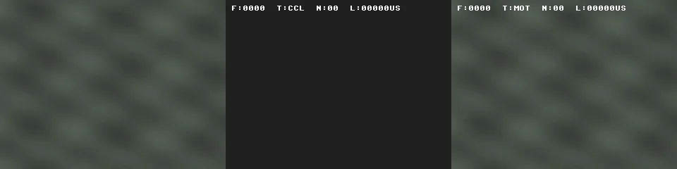

# sparevideo

Video processing pipeline with motion detection and bounding-box overlay, written in SystemVerilog and verified via Verilator with a file-based Python harness.

## Demo

End-to-end animated triptychs: **Input | CCL BBOX | MOTION**, each panel 320×240, ~3 s @ 15 fps, regenerable from `make demo`.

### Synthetic input (`multi_speed_color`)



Three colored objects with distinct speeds and trajectories on a tinted textured background. Used as the canonical regression-style demo: deterministic, fully regenerable, frame 0 is bg-only by construction so EMA priming starts clean.

### Real video (Pexels)

The pipeline ships with three real-source clips (intersection, birdseye, people). Stabilized 320×240 masters live in [`media/source/`](media/source/) and are documented in [`media/source/README.md`](media/source/README.md). Build a per-clip triptych WebP with `make demo-real-<name>` (RTL backend) or `make demo-real-<name> EXP=1` (Python reference model — much faster, output goes to a non-publishable draft dir).

## Overview

`sparevideo_top` accepts an AXI4-Stream RGB888 input on a 25 MHz pixel clock, crosses into a 100 MHz DSP clock domain, runs a **control-flow-selectable** pipeline (passthrough, motion detection + N-way bbox overlay, mask display, or mask-as-grey + CCL-bbox debug), crosses back to the pixel clock, and drives a VGA controller. A 2-bit `ctrl_flow_i` sideband selects the active path.

Per-module architecture and design decisions live in [`docs/specs/`](docs/specs/):

| Document | Module |
|----------|--------|
| [`sparevideo-top-arch.md`](docs/specs/sparevideo-top-arch.md) | Top-level pipeline, clock domains, FIFO sizing, SVAs |
| [`axis_motion_detect-arch.md`](docs/specs/axis_motion_detect-arch.md) | Motion mask generation, RAM port discipline, backpressure (EMA background model) |
| [`axis_motion_detect_vibe-arch.md`](docs/specs/axis_motion_detect_vibe-arch.md) | ViBe background-subtraction block (parametric K∈{8,20}, external-init, defer-FIFO for two-pass update semantics) |
| [`axis_hflip-arch.md`](docs/specs/axis_hflip-arch.md) | Horizontal mirror (selfie-cam) AXIS stage with single line buffer + `enable_i` bypass |
| [`axis_window3x3-arch.md`](docs/specs/axis_window3x3-arch.md) | Reusable 3x3 sliding-window primitive (line buffers + window regs + edge handling; `EDGE_POLICY` parameter) |
| [`axis_gauss3x3-arch.md`](docs/specs/axis_gauss3x3-arch.md) | 3x3 Gaussian pre-filter on Y channel |
| [`axis_morph_clean-arch.md`](docs/specs/axis_morph_clean-arch.md) | 3x3 morphological opening + parametrizable 3x3/5x5 closing on mask; runtime gates `morph_open_en` / `morph_close_en`; compile-time `morph_close_kernel` |
| [`axis_gamma_cor-arch.md`](docs/specs/axis_gamma_cor-arch.md) | Per-channel sRGB gamma correction at output tail (33-entry LUT + linear interp, `enable_i` bypass) |
| [`axis_ccl-arch.md`](docs/specs/axis_ccl-arch.md) | Streaming 8-connected connected-component labeler + top-N bbox selector |
| [`axis_overlay_bbox-arch.md`](docs/specs/axis_overlay_bbox-arch.md) | `N_OUT`-wide rectangle overlay on RGB video |
| [`axis_scale2x-arch.md`](docs/specs/axis_scale2x-arch.md) | 2x bilinear spatial upscaler; controlled via `CFG.scaler_en` |
| [`axis_hud-arch.md`](docs/specs/axis_hud-arch.md) | 8x8 bitmap text HUD overlay (frame# / ctrl-flow tag / bbox count / latency µs) at the post-scaler tail; controlled via `CFG.hud_en` |
| [`rgb2ycrcb-arch.md`](docs/specs/rgb2ycrcb-arch.md) | RGB888 → Y8 color-space converter |
| [`ram-arch.md`](docs/specs/ram-arch.md) | Dual-port byte RAM, region descriptor model |
| [`vga_controller-arch.md`](docs/specs/vga_controller-arch.md) | VGA timing generator |

## Project Structure

```
hw/
├── top/                       sparevideo_top.sv, sparevideo_pkg.sv, ram.sv (sim-only)
├── ip/<block>/rtl/            Per-IP RTL: rgb2ycrcb, axis (fork), hflip, window, filters
│                              (gauss3x3, morph3x3_*), gamma, scaler, hud, motion, ccl,
│                              overlay, vga
├── ip/<block>/tb/             Per-IP unit testbenches (Verilator)
└── lint/                      Verilator waivers (project + third-party)

dv/
├── sv/                        Top-level integration testbench + DPI-C helpers
├── sim/                       Makefile (sim + test-ip targets)
└── data/                      Generated I/O scratch (gitignored)

py/
├── harness.py                 Pipeline CLI: prepare / verify / render
├── profiles.py                Algorithm profile definitions (mirrors cfg_t in sparevideo_pkg.sv)
├── frames/                    Frame I/O + video source loaders
├── models/                    Per-control-flow reference models (passthrough, motion, mask, ccl, ccl_bbox)
├── viz/                       Comparison-grid renderer
└── tests/                     Frame I/O / model / profile-parity unit tests

renders/                       PNG comparison grids from `make render` (gitignored)
third_party/verilog-axis/      Vendored alexforencich/verilog-axis (MIT)
```

Each IP has its own architecture spec under `docs/specs/` (linked above) and its own unit testbench under `hw/ip/<block>/tb/`. The integration testbench (`dv/sv/tb_sparevideo.sv`) drives full-pipeline simulation; `make run-pipeline` orchestrates Python prepare → Verilator sim → Python verify/render.

## Prerequisites

- **Verilator** 5.0+ (simulation and linting)
- **GCC** (Verilator uses it internally)
- **Python** 3.10+ with venv
- **GTKWave** (optional, waveform viewer)

## Setup

```bash
# Install Verilator, GCC, and GTKWave
sudo apt install -y verilator gcc gtkwave

# Create Python venv and install deps
python3 -m venv .venv
.venv/bin/pip install -r requirements.txt

# Or use the setup target:
make setup
```

## Usage

There are three levels of testing:

- **`make run-pipeline`** — End-to-end integration. Python generates input frames, Verilator simulates the full RTL pipeline, then Python compares the RTL output against a reference model pixel-by-pixel. This is the primary way to verify the design.
- **`make test-ip`** — Per-block SV unit testbenches. Each RTL module has its own testbench with known-good vectors and edge cases. Fast, no Python involved.
- **`make test-py`** — Python unit tests. Verifies the reference models and frame I/O independently of RTL simulation.

```bash
# Run the full pipeline: prepare (py) → compile (verilator) → sim (verilator) → verify (py) → render (py)
make run-pipeline

# With custom source and options
make run-pipeline SOURCE="synthetic:moving_box" CTRL_FLOW=motion
make run-pipeline SOURCE=path/to/video.mp4 MODE=binary

# Control flow selection (model-based verification at TOLERANCE=0)
make run-pipeline CTRL_FLOW=passthrough   # identity — exact match
make run-pipeline CTRL_FLOW=motion        # motion detect + N-bbox overlay — pixel-accurate model
make run-pipeline CTRL_FLOW=mask          # raw motion mask — B/W output for debugging
make run-pipeline CTRL_FLOW=ccl_bbox      # mask-as-grey canvas + CCL bboxes (debug CCL directly)

# Algorithm profile selection (default: default; mirror is OFF in default)
make run-pipeline CFG=default
make run-pipeline CFG=default_hflip          # selfie-cam mirror enabled
make run-pipeline CFG=no_ema                 # alpha=1 → raw frame differencing
make run-pipeline CFG=no_morph               # 3x3 mask opening AND closing bypassed
make run-pipeline CFG=no_gauss               # 3x3 Gaussian pre-filter bypassed
make run-pipeline CFG=no_gamma_cor           # sRGB gamma correction bypassed
make run-pipeline CFG=no_scaler              # disable 2x output upscaler (output at input resolution)
make run-pipeline CFG=no_hud                 # bitmap HUD overlay bypassed

# Run per-block IP unit testbenches (fast, Verilator)
make test-ip

# Lint only
make lint
```

`make run-pipeline` runs these steps in order, passing all options automatically:

| Step | Target | What runs | Description |
|------|--------|-----------|-------------|
| 1 | `prepare` | Python | Generate input frames from source — **saves options** to `dv/data/config.mk` |
| 2 | `compile` | Verilator | Compile RTL + testbench into a binary |
| 3 | `sim` | Verilator | Run RTL simulation, write output frames to file |
| 4 | `verify` | Python | Compare RTL output against reference model (pixel-accurate) |
| 5 | `render` | Python | Save input vs output comparison PNG |

### Running steps individually

`make prepare` saves `WIDTH`, `HEIGHT`, `FRAMES`, and `MODE` to `dv/data/config.mk`. All subsequent steps load that file automatically:

```bash
make prepare SOURCE="synthetic:moving_box" WIDTH=320 HEIGHT=240 FRAMES=8
make sim
make verify   # uses saved CTRL_FLOW to select the reference model
make render
```

`SIMULATOR` and `TOLERANCE` are not saved — specify them explicitly when needed:

| Option | Saved by `prepare`? | Used by |
|--------|:-------------------:|---------|
| `WIDTH` | ✓ | `prepare`, `sim`, `sim-waves`, `sw-dry-run` |
| `HEIGHT` | ✓ | `prepare`, `sim`, `sim-waves`, `sw-dry-run` |
| `FRAMES` | ✓ | `prepare`, `sim`, `sim-waves`, `sw-dry-run` |
| `MODE` | ✓ | `prepare`, `sim`, `sim-waves`, `sw-dry-run`, `verify`, `render` |
| `CTRL_FLOW` | ✓ | `compile`, `sim`, `sim-waves`, `sw-dry-run`, `verify` |
| `CFG` | ✓ | `compile`, `sim`, `sim-waves`, `sw-dry-run`, `verify` |
| `SIMULATOR` | — | `compile`, `sim`, `sim-waves`, `sw-dry-run` |
| `TOLERANCE` | — | `verify` |
| `SOURCE` | ✓ | `prepare` only |

```bash
# Other targets
make lint                    # Verilator lint
make test-ip                 # All per-block IP unit testbenches
make test-ip-<block>         # Single-block unit testbench (rgb2ycrcb, hflip, gamma-cor, window,
                             #   gauss3x3, motion-detect, ccl, overlay-bbox, ...)
make sw-dry-run              # Bypass RTL — file loopback, zero sim time
make sim-waves               # RTL sim + open GTKWave
make compile                 # Compile only
make test-py                 # Python unit tests (frame I/O + reference models)
```

### Regenerating the demo

Two-stage workflow: build to a gitignored draft dir, preview, then publish to the README-referenced dir when happy.

```bash
make demo                                                          # build all WebPs into media/demo-draft/
make demo-synthetic                                                # just synthetic.webp
make demo-real                                                     # all real-source WebPs (each name in REAL_SOURCES)
make demo-real-intersection                                        # one real WebP
explorer.exe "$(wslpath -w media/demo-draft/intersection.webp)"    # preview the draft (WSL)
make demo-publish                                                  # promote media/demo-draft/*.webp → media/demo/
make demo-publish WHICH=synthetic                                  # promote one panel only (WHICH=<name>)
grip README.md                                                     # preview README at github.com fidelity
```

`media/demo-draft/` is gitignored — iterate freely. `media/demo/` is what the README points at; commit the published WebPs alongside the RTL change that produced them.

**Iterating on a new real clip without RTL sim.** Pass `EXP=1` to use the bit-accurate Python reference model in place of Verilator. Output lands in `media/demo-draft-exp/` (gitignored), which `demo-publish` never reads — so EXP runs are physically un-publishable.

```bash
make demo-real-intersection EXP=1                                  # ~minutes; output → media/demo-draft-exp/
explorer.exe "$(wslpath -w media/demo-draft-exp/intersection.webp)"
```

EXP runs default to the full 10 s master (`DEMO_EXP_FRAMES=150`); default RTL runs use 3 s (`DEMO_PUBLISH_FRAMES=45`) for github-friendly README WebPs. A clip's master can be shorter than 10 s — set `DEMO_EXP_FRAMES_<name>` per clip (see `people` for an example: 5 s).

Knobs: `DEMO_PUBLISH_FRAMES=45 DEMO_EXP_FRAMES=150 DEMO_WIDTH=320 DEMO_HEIGHT=240 DEMO_FPS=15`. Each RTL build runs `prepare → compile → sim` twice (`ccl_bbox` + `motion`) under `CFG=demo`, then assembles the triptych via `python -m demo`. With `EXP=1` the `compile`+`sim` pair is replaced by `python harness.py model`.

**Adding a new real clip.** Stage a raw download in `media/source_raw/` (gitignored), then:

```bash
make demo-prepare SRC=media/source_raw/foo.mp4 NAME=foo START=0 DURATION=10
# adds media/source/foo-320x240.mp4
# add 'foo' to REAL_SOURCES in the Makefile
make demo-real-foo EXP=1                                           # quick preview
make demo-real-foo                                                 # final RTL build
make demo-publish WHICH=foo
```

The stabilizer (`py/demo/stabilize.py`) does KLT-tracked similarity warping plus a two-pass safe-rect crop that eliminates edge artifacts on rotated drone footage. See [`media/source/README.md`](media/source/README.md) for clip provenance, license notes, and per-clip prep commands.

`grip` is an optional dev tool (`pip install grip`) that renders local markdown using GitHub's API — useful for confirming the README looks right before pushing.

## Options

| Option | Default | Description |
|--------|---------|-------------|
| `SIMULATOR` | `verilator` | Simulator to use (`verilator`) |
| `CTRL_FLOW` | `motion` | Control flow: `passthrough` (no processing), `motion` (motion detect + bbox overlay), `mask` (raw motion mask as B/W image), or `ccl_bbox` (mask-as-grey + CCL bboxes) |
| `CFG` | `default` | Algorithm profile. Selects a named bundle of algorithm parameters from `py/profiles.py` / `sparevideo_pkg.sv`. See table below for available profiles. |
| `SOURCE` | `synthetic:moving_box` | Input source (only used by `prepare`). See table below for available patterns. Also accepts MP4/AVI files (OpenCV) or a PNG directory. |
| `WIDTH` | `320` | Frame width in pixels |
| `HEIGHT` | `240` | Frame height in pixels |
| `FRAMES` | `4` | Number of frames |
| `MODE` | `text` | File format: `text` (hex) or `binary` |
| `TOLERANCE` | `0` | Max differing pixels per frame in `verify`. Default is 0 (pixel-accurate model-based verification). |

### Algorithm Profiles

| Profile | Description |
|---------|-------------|
| `default` | All stages on, 2x scaler ON, HUD ON, mirror OFF. Default EMA background model. |
| `default_hflip` | Default with horizontal mirror enabled (selfie-cam). |
| `no_ema` | Raw frame differencing (alpha=1). |
| `no_morph` | 3x3 morphological opening and closing bypassed. |
| `no_gauss` | 3x3 Gaussian pre-filter bypassed. |
| `no_gamma_cor` | sRGB gamma correction bypassed (linear at output). |
| `no_scaler` | 2x output upscaler disabled; output at input resolution. |
| `no_hud` | Bitmap HUD overlay bypassed. |
| `default_vibe` | Recommended ViBe profile: K=8, R=20, look-ahead median init (Python-only at Phase 1). |
| `vibe_k20` | ViBe with literature-default K=20 (~2.5x sample-bank RAM vs default_vibe). |
| `vibe_no_diffuse` | Negative-control ablation: diffusion disabled. |
| `vibe_no_gauss` | ViBe with 3x3 Gaussian pre-filter bypassed. |
| `vibe_init_frame0` | ViBe with legacy frame-0 init (A/B vs default_vibe). |

### Synthetic Sources

| Pattern | Description |
|---------|-------------|
| `synthetic:moving_box` | Red box, diagonal top-left → bottom-right |
| `synthetic:dark_moving_box` | Dark box on bright background (tests polarity-agnostic mask) |
| `synthetic:two_boxes` | Red + cyan boxes moving in opposing directions |
| `synthetic:noisy_moving_box` | Red box on noisy background (±10 luma jitter). Tests EMA noise suppression — `CFG=no_ema` (alpha=1, raw differencing) produces false positives; `CFG=default` or any profile with `alpha_shift>=2` suppresses them. |
| `synthetic:lighting_ramp` | Moving box on slowly brightening background (+1 luma/frame). Tests EMA tracking of gradual lighting changes. |
| `synthetic:textured_static` | Sinusoid-textured static background with per-frame sensor noise. Negative test — mask must be all-black after EMA convergence. |
| `synthetic:entering_object` | Two soft-edged boxes entering from opposite edges, crossing the centre. Textured+noisy bg. |
| `synthetic:multi_speed` | Three soft-edged boxes with distinct speeds and directions (fast L→R, medium T→B, slow diagonal). Textured+noisy bg. Exercises N-way CCL tracking. |
| `synthetic:multi_speed_color` | Colored variant of `multi_speed`: red / green / cyan soft-edged boxes on a tinted RGB textured bg. Used for the README demo (`make demo-synthetic`). |
| `synthetic:stopping_object` | Box A stops after half the frames; box B moves throughout. Textured+noisy bg. Exercises selective-EMA slow-rate absorption. |
| `synthetic:lit_moving_object` | Two soft-edged boxes on a bg whose left↔right illumination gradient shifts ~2 luma/frame. Textured+noisy bg. |

Motion patterns are best tested with `FRAMES=8` or higher for meaningful multi-frame tracking. All patterns with moving objects render frame 0 as background-only — objects appear from frame 1 onward, so the EMA hard-init at frame 0 primes bg with clean background (no frame-0 ghost).

### Motion detection threshold (`motion_thresh`)

A pixel is flagged as motion when `|Y − bg| > CFG.motion_thresh`, where `bg` is the per-pixel EMA background model. Default is `16` (≈6.25% of full scale). To change it, add a new profile to `hw/top/sparevideo_pkg.sv` (mirror it in `py/profiles.py`) and run `make run-pipeline CFG=<your_profile>`. See [`axis_motion_detect-arch.md`](docs/specs/axis_motion_detect-arch.md) for the full algorithm (polarity-agnostic mask, two-rate EMA, frame-0 hard-init).

For the `mask` control flow, `make verify` also reports per-frame motion-pixel counts — useful for diagnosing false positives.

### File Formats

Frame data is passed between Python and the SV testbench via files on disk. Python writes input frames before simulation and reads output frames back for verification. The `MODE` option selects the format.

**Text mode** (`.txt`): Space-separated 6-digit hex pixels (RRGGBB), one row per line. No header.
```
FF0000 FF0000 00FF00 00FF00
FF0000 FF0000 00FF00 00FF00
```

**Binary mode** (`.bin`): 12-byte header (width, height, frames as LE uint32) + raw RGB bytes (3 bytes/pixel, row-major).

## License

Apache License 2.0
